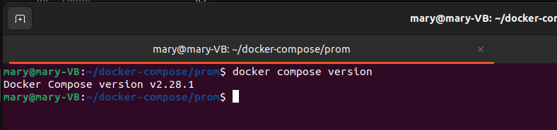
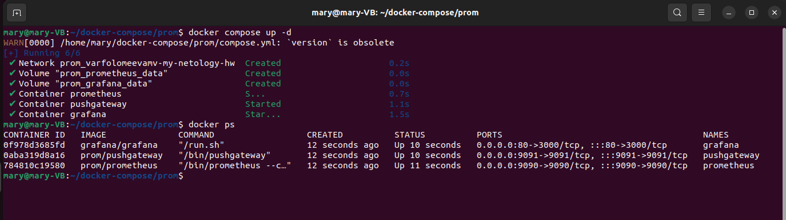
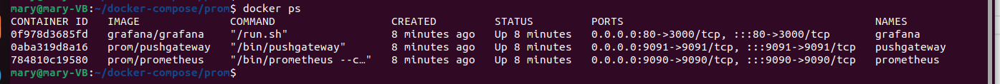
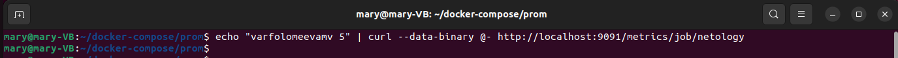
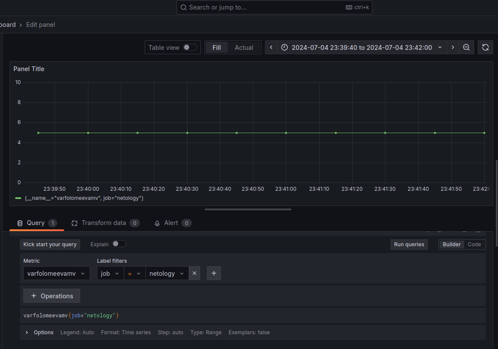

# Домашнее задание к занятию "`Docker. Часть 2`" - `Варфоломеева Марьяна`


### Задание 1

`Установите Docker Compose и опишите, для чего он нужен и как может улучшить вашу жизнь.`

### Ответ

1. `Docker Compose установлен:`



2. `Docker Compose нужен для управления многоконтейнерными приложениями с помощью файла конфигурации YAML.
Docker Compose упрощает запуск и оркестрацию контейнеров в различных среда`

---
### Задание 2

**Выполните действия и приложите текст конфига на этом этапе.** 

Создайте файл docker-compose.yml и внесите туда первичные настройки: 

 * version;
 * services;
 * volumes;
 * networks.

При выполнении задания используйте подсеть 10.5.0.0/16.
Ваша подсеть должна называться: <ваши фамилия и инициалы>-my-netology-hw.
Все приложения из последующих заданий должны находиться в этой конфигурации.
### Ответ:
Первоначальные настройки для compose.yml

```
version: '3'
services:
volumes:
networks:
  varfolomeevamv-my-netology-hw:
    driver: bridge
    ipam:
     config:
       - subnet: "10.5.0.0/16"
         gateway: "10.5.0.1"
```
---
### Задание 3 

**Выполните действия:** 

1. Создайте конфигурацию docker-compose для Prometheus с именем контейнера <ваши фамилия и инициалы>-netology-prometheus. 
2. Добавьте необходимые тома с данными и конфигурацией (конфигурация лежит в файле [prometheus.yml](./docker_files/prometheus.yml))
3. Обеспечьте внешний доступ к порту 9090 c докер-сервера.

### Ответ:
```
services:
  varfolomeevamv-netology-prometheus:
    image: prom/prometheus
    container_name: prometheus
    ports:
      - 9090:9090
    volumes:
      - ./prometheus.yml:/etc/prometheus/prometheus.yml
      - prometheus_data:/prometheus
    networks:
      - varfolomeevamv-my-netology-hw
    restart: always

volumes:
  prometheus_data: {}

```
---
### Задание 4 

**Выполните действия:**

1. Создайте конфигурацию docker-compose для Pushgateway с именем контейнера <ваши фамилия и инициалы>-netology-pushgateway. 
2. Обеспечьте внешний доступ к порту 9091 c докер-сервера.

### Ответ:
```
services:
  varfolomeevamv-netology-prometheus:
    ...
  varfolomeevamv-netology-pushgateway:
    depends_on: ["varfolomeevamv-netology-prometheus"]
    image: prom/pushgateway
    container_name: pushgateway
    ports:
      - 9091:9091
    networks:
      - varfolomeevamv-my-netology-hw
    restart: unless-stopped

```
---
### Задание 5 

**Выполните действия:** 

1. Создайте конфигурацию docker-compose для Grafana с именем контейнера <ваши фамилия и инициалы>-netology-grafana. 
2. Добавьте необходимые тома с данными и конфигурацией (файл с конфигурацией [custom.ini](./docker_files/custom.ini))
3. Добавьте переменную окружения с путем до файла с кастомными настройками (должен быть в томе), в самом файле пропишите логин=<ваши фамилия и инициалы> пароль=netology.
4. Обеспечьте внешний доступ к порту 3000 c порта 80 докер-сервера.


### Ответ:
```
version: '3'
services:
  varfolomeevamv-netology-prometheus:
    ...
  varfolomeevamv-netology-pushgateway:
    ...
  varfolomeevamv-netology-grafana:
    depends_on: ["varfolomeevamv-netology-pushgateway"] 
    image: grafana/grafana
    container_name: grafana
    environment:
      - GF_PATHS_CONFIG=/etc/grafana/custom.ini
    ports:
      - 80:3000
    volumes:
      - ./custom.ini:/etc/grafana/custom.ini
      - grafana_data:/var/lib/grafana
    networks:
      - varfolomeevamv-my-netology-hw
    restart: unless-stopped

volumes:
  prometheus_data: {}
  grafana_data: {} 

```
---
### Задание 6 

**Выполните действия.**

1. Настройте поочередность запуска контейнеров.
2. Настройте режимы перезапуска для контейнеров.
3. Настройте использование контейнерами одной сети.
5. Запустите сценарий в detached режиме.

### Ответ:
Очередность запуска настраивается через depends_on:
Режим перезапуска - через restart
Сеть - через Networks.

Для запуска в detached режиме используется команда

```
docker compose up -d
```


---
### Задание 7 

**Выполните действия.**
1. Выполните запрос в Pushgateway для помещения метрики <ваши фамилия и инициалы> со значением 5 в Prometheus: 
  ```echo "<ваши фамилия и инициалы> 5" | curl --data-binary @- http://localhost:<внешний порт выбранный вами в задании 4>/metrics/job/netology```
3. Залогиньтесь в Grafana с помощью логина и пароля из предыдущего задания.
3. Cоздайте Data Source Prometheus (Home -> Connections -> Data sources -> Add data source -> Prometheus -> указать "Prometheus server URL = http://prometheus:9090" -> Save & Test).
4. Создайте график на основе добавленной в пункте 5 метрики (Build a dashboard -> Add visualization -> Prometheus -> Select metric -> Metric explorer -> <ваши фамилия и инициалы -> Apply.

### Ответ:

Сформированный докер файл:
[файл docker compose](./docker_files/compose.yml)

``` docker ps  ```


Запрос в Pushgateway:


Полученный график:
